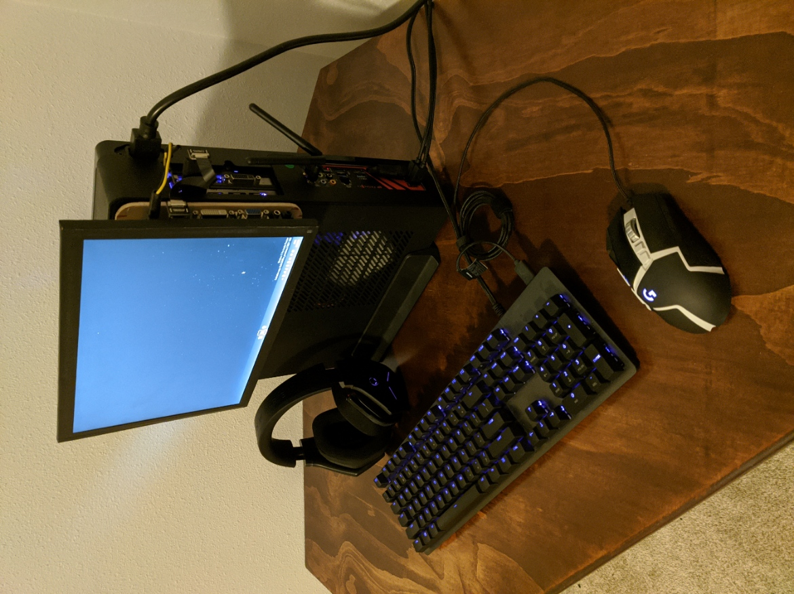

# Custom Hardware
Sometimes you can't get the job done with off-the-shelf stuff...at least not *cheaply*.

## Portable Monitor
> The power of a screen, in the...back of my pack...

When I was building out my backpack-sized gaming PC, I realized that I would need to have a display of some sort that could fit in a backpack as well.
If you think about it, what I was looking for was just the top half of a laptop.

So that's what I did. I grabbed an old laptop that was too old to be useful, removed the top half, built a custom enclosure, and bought a power supply.
Then I modded my desktop to add a power plug for the monitor directly from the PC.

## PiKVM
> The world's geekiest TV remote

I've been getting a little sick and tired of Google Photos lately. The backups, sharing, and searchability are nice, but 15GB is not nearly enough storage.

To fix the storage limit, I built myself a server; and to manage it remotely, I built out a [PiKVM](http://www.pikvm.org) using an old Raspberry Pi 2 that I've had lying around for a while.
Unlike the newest versions of the PiKVM, which use the latest in Raspberry Pi hardware, my Pi required extra hardware and for me to build out the PiKVM software from scratch on my own, instead of just downloading an installer.

With the PiKVM, I effectively have a keyboard, mouse, monitor, and power button plugged into my server, all controllable from the internet.
